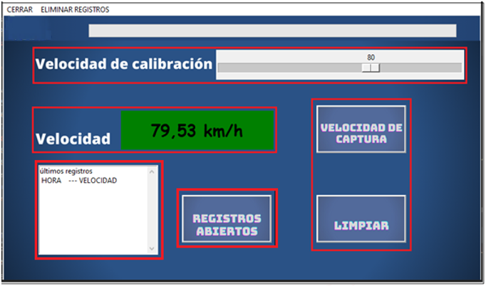
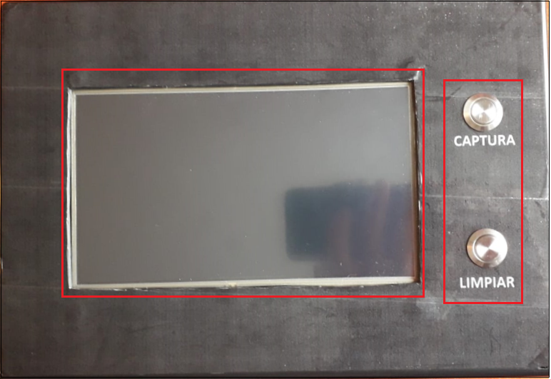
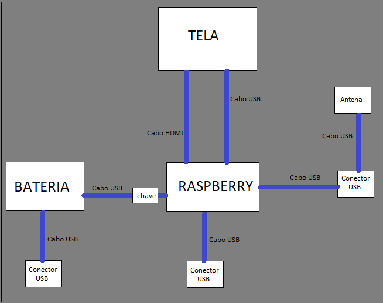

# Velocímetro assistido por GNSS

Velocímetro portátil que mede e registra a velocidade de um veículo a partir de sinais de satélite (GPS, GLONASS, Galileo...). Ele serve de **referência em testes de calibração de radares de velocidade**: o operador escolhe a velocidade de calibração, passa pelo ponto de teste e captura a velocidade medida por satélite, que fica gravada num arquivo de registro com data e hora.

O equipamento final roda em uma **Raspberry Pi 4** com tela touchscreen de 7", antena GNSS USB, botões físicos e bateria, tudo montado numa caixa de ABS. O software foi escrito em **Python** com interface gráfica em **Tkinter**.





> O relatório técnico completo, com o manual de uso, a montagem e os testes de campo, está em [relatorio.md](relatorio.md).

## Destaques

- **Leitura de protocolo NMEA 0183** pela porta serial. `$GNVTG` fornece a velocidade em km/h e `$GNRMC` fornece a data e hora UTC, que são convertidas para o fuso horário local.
- **Configuração do receptor via protocolo binário UBX**: o software envia o comando `CFG-RATE` para que a antena u-blox atualize a posição a 10 Hz.
- **Indicação visual de tolerância**: o visor fica verde quando a velocidade medida está a ±1 km/h da velocidade de calibração escolhida, e vermelho fora dessa faixa.
- **Registro persistente** das capturas em `log.txt`, com um cabeçalho de data e hora a cada início de teste.
- **Botões físicos nos GPIOs da Raspberry Pi**: a captura usa interrupção por borda de descida (GPIO 27, com debounce de 500 ms) e a limpeza da tela é lida por polling (GPIO 22).
- **GUI responsiva com threads**: a interface Tkinter roda na thread principal e a leitura serial numa thread separada.
- **Inicialização automática** na Raspberry Pi através de um serviço `systemd`.

## Tecnologias

| Área | Itens |
|---|---|
| Linguagem e bibliotecas | Python 3.9, `tkinter`, `threading`, `pyserial`, `pytz`, `RPi.GPIO` |
| Protocolos | NMEA 0183 (`$GNVTG`, `$GNRMC`), UBX (u-blox) |
| Hardware | Raspberry Pi 4B, tela touchscreen 7" 800x480 (Adafruit 2407), antena GNSS Navilock NL-8004U (u-blox), power bank 5000 mAh, botões push button de inox com pull-down de 10 kΩ |
| Sistema | Raspbian + `systemd` |

## Como funciona

1. **Tela de ajustes ([Com.py](Com.py))**: ao iniciar, o programa abre uma janela para escolher a porta COM da antena e o fuso horário (UTC-12 a UTC+12). Ao fechar a janela, a porta serial é aberta a 115200 baud.
2. **Tela principal ([Velocidade.py](Velocidade.py))**: janela fixa de 800x480 (o tamanho da tela touchscreen). Os widgets são posicionados sobre a imagem de fundo [imagens/main.png](imagens/main.png).
3. **Thread de leitura serial (`read_serial`)**:
   - envia os comandos UBX que configuram a taxa de 10 Hz;
   - descarta cerca de 100 linhas durante o *cold start* do receptor enquanto preenche a barra de progresso;
   - em loop, separa cada sentença NMEA pelas vírgulas: o campo 7 de `$GNVTG` é a velocidade em km/h, e `$GNRMC` com status `A` (posição válida) fornece a data e a hora.
4. **Captura**: o botão "capturar velocidade" (o físico na Raspberry Pi ou o da tela) grava `HORA --- VELOCIDADE` no `log.txt` e no histórico da tela. Na versão para desktop, a barra de espaço faz o papel do botão físico. O botão "limpar" esvazia apenas o histórico da tela; o menu "APAGAR REGISTROS" zera o arquivo de log.



## Resultados do teste de campo

Comparação com um radar já calibrado, num ponto de teste, em 19/04/2023:

| Horário | Radar calibrado | Velocímetro GNSS | Diferença |
|---|---|---|---|
| 14:53:31 | 34 km/h | 35,752 km/h | +1,75 km/h |
| 14:55:35 | 49 km/h | 47,758 km/h | −1,24 km/h |

O teste também mostrou por que a velocidade vem da sentença `$GNVTG`: com o veículo a 38 km/h, `$GNRMC` indicou 32,287 km/h, enquanto `$GNVTG` indicou 38,893 km/h.

## Lista de componentes

Raspberry Pi 4 B (4 GB), tela touchscreen 7" Adafruit 2407, antena GNSS Navilock NL-8004U, power bank 5000 mAh, push buttons, chave seletora, extensor USB, cabo USB tipo C, cartão de memória e caixa Patola BP-225 (110x175x255 mm). A planilha com links e preços está em [Lista de componentes.xlsx](Lista%20de%20componentes.xlsx).

## Versões do código

| Versão | Onde roda | Diferenças |
|---|---|---|
| [Versão para Raspbian/](Versão%20para%20Raspbian/) | Raspberry Pi (versão embarcada) | Lê os botões físicos pelos GPIOs (`RPi.GPIO`), tem a interface em espanhol e usa os fundos da sua própria pasta [imagens/](Versão%20para%20Raspbian/imagens/). As subpastas `backup` guardam layouts anteriores, incluindo um em português e outro com campos de latitude e longitude. |
| [Velocidade.py](Velocidade.py) | Desktop (Windows ou Linux) | Interface em português e sem GPIO: a barra de espaço faz o papel do botão físico de captura (veja [Intruções.txt](Intruções.txt)). |
## Executando

Requisitos: Python 3 com Tkinter e uma antena GNSS u-blox ligada a uma porta USB/serial. Execute sempre a partir do diretório do script, porque as imagens e o `log.txt` são acessados por caminho relativo. Se a porta COM escolhida estiver errada, o programa não inicia: feche-o e execute de novo.

**Desktop:**

```powershell
pip install pyserial pytz
cd "GNSS\Velocímetro"
python Velocidade.py
```

**Raspberry Pi:**

```bash
pip3 install pyserial pytz RPi.GPIO
cd "GNSS/Velocímetro/Versão para Raspbian"
python3 Velo.V1.8.py
```

Para iniciar o aplicativo automaticamente quando a Raspberry Pi liga, crie o serviço `systemd` descrito na secção [3.2 Software do relatório](relatorio.md#32-software).

## Arquivos

| Arquivo | Função |
|---|---|
| [Versão para Raspbian/](Versão%20para%20Raspbian/) | Versão embarcada: `Velo.V1.8.py` com GPIO, `Com.py`, imagens e `log.txt` próprios |
| [Velocidade.py](Velocidade.py) | Versão para desktop: GUI, leitura serial e registro || [Com.py](Com.py) | Tela de ajustes da versão para desktop: porta COM e fuso horário |
| [imagens/](imagens/) | Fundo e botões da GUI para desktop; [imagens/relatorio/](imagens/relatorio/) contém as figuras do relatório |
| [log.txt](log.txt) | Registro das velocidades capturadas |
| [relatorio.md](relatorio.md) | Relatório de projeto completo |
| [Lista de componentes.xlsx](Lista%20de%20componentes.xlsx) | Lista de materiais com links de compra |
| [default.uws](default.uws) | Arquivo de workspace (configuração de janelas) |

## Melhorias futuras

- **Captura automática por coordenada**: capturar a velocidade sozinho ao passar por um ponto escolhido. Exige uma antena mais precisa que a NL-8004U (cerca de 5 m sem SBAS, 2 m com SBAS).
- **Gabinete mais compacto** feito em impressora 3D.
- **Gerenciamento de carga**, para permitir usar o equipamento enquanto a bateria carrega.
