# RELATÓRIO DE PROJETO — Velocímetro

## Informações iniciais

Este documento contém as informações básicas necessárias de especificações e operação do produto, a fim de proporcionar o uso correto do velocímetro. Além de informações sobre desenvolvimento e futuras melhorias.

## Sumário

1. [Apresentação](#1-apresentação)
2. [Modo de usar](#2-modo-de-usar)
3. [Especificações técnicas](#3-especificações-técnicas)
   1. [Hardware](#31-hardware)
   2. [Software](#32-software)
4. [Diagrama](#4-diagrama)
5. [Teste de campo](#5-teste-de-campo)
6. [Futuras melhorias](#6-futuras-melhorias)

---

## 1. Apresentação

O velocímetro assistido por satélite foi desenvolvido para mostrar e registrar uma velocidade precisa, medida em quilômetros por hora (km/h). Uma antena GNSS (Global Navigation Satellite System) deve ser conectada ao equipamento para captar sinais emitidos pelas várias constelações de satélites de posicionamento geoespacial distribuídos pelo globo terrestre, como o GLONASS, Galileo, GPS e outros.

A antena GNSS recebe os sinais `$GNVTG` e `$GNRMC` do protocolo GNSS, que são tratados pelo software desenvolvido em Python. O protocolo `$GNVTG` fornece a velocidade em quilômetros por hora (km/h), e o protocolo `$GNRMC` fornece a data e hora no padrão UTC. O protocolo `$GNRMC` também fornece a velocidade medida em km/h, porém não apresentou uma velocidade confiável nos testes realizados, e por isso esse protocolo não foi usado para medir velocidade.

O velocímetro funciona em um sistema operacional Raspbian, instalado em uma placa de desenvolvimento Raspberry Pi 4. Com a tela touchscreen de 7 polegadas, conectada à placa Raspberry Pi, é possível realizar uma interface entre o dispositivo e o usuário.

A antena GNSS não possui uma boa recepção de sinal em ambientes fechados, porém mostrou uma captura de sinal satisfatória dentro de automóveis. Caso o velocímetro esteja em um ambiente aberto e mesmo assim não capture sinal, mostrando a mensagem "CARREGANDO" em seu mostrador de velocidade, possivelmente a antena está com defeito. Para visualizar e alterar configurações da antena GNSS, é possível usar o software "u-center", fornecido pela u-blox através do link: <https://www.u-blox.com/en/product/u-center>.

## 2. Modo de usar

**1° Passo:** Conecte a antena GNSS da figura 01 no conector de antena do velocímetro, conforme a figura 02.

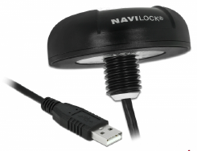

*Figura 1 – Antena GNSS.*

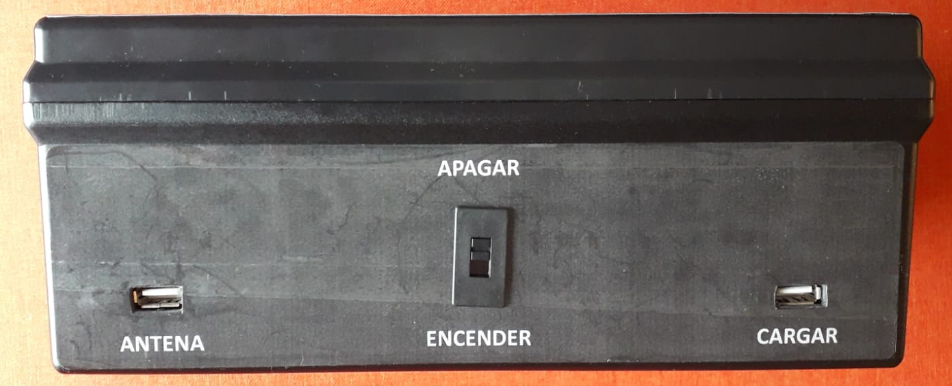

*Figura 2 – Vista lateral, mostrando da esquerda para a direita os conectores de antena, botão para ligar ou desligar, e conector para carregar a bateria.*

**2° Passo:** Ligue o equipamento no botão de ligar, demonstrado na figura 02, e aguarde o sistema operacional iniciar.

> **ATENÇÃO:** Não é possível usar o velocímetro enquanto a bateria é carregada, para evitar danos à bateria. Para carregar o dispositivo, conecte um cabo USB no conector mostrado na figura 02. O nível de carga da bateria é mostrado na figura 03. O tempo de duração da bateria com carga completa em uso contínuo é de aproximadamente 3 horas.

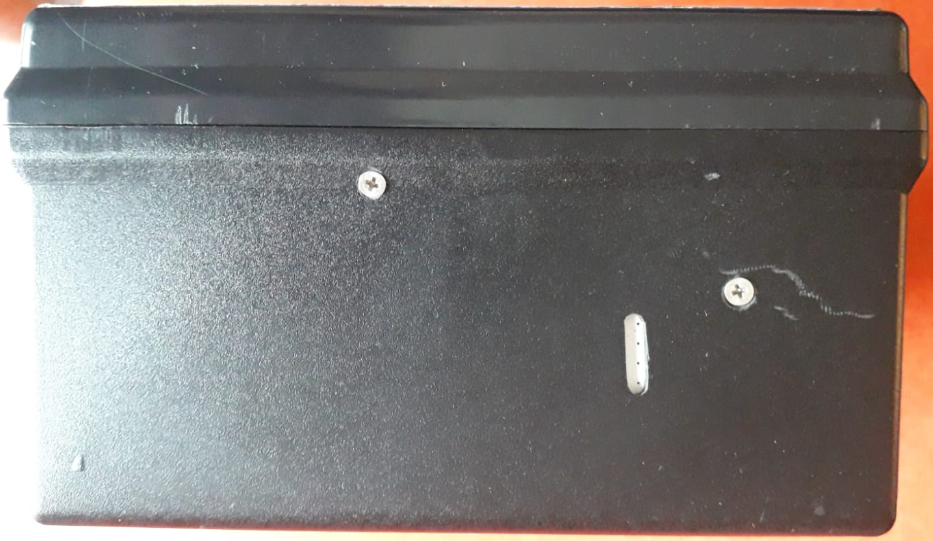

*Figura 3 – Vista lateral, mostrando o nível de carga da bateria.*

**3° Passo:** Após o sistema operacional carregar, o aplicativo do velocímetro iniciará automaticamente, mostrando uma tela de ajustes, ilustrada na figura 04. Selecione a porta de comunicação em que a antena GNSS está conectada e também o fuso horário local, pois a data e hora recebidas pela antena estão no formato UTC (Tempo Universal Coordenado). Por fim, feche a tela de ajustes. Por padrão, a porta de comunicação já estará configurada para a antena GNSS.

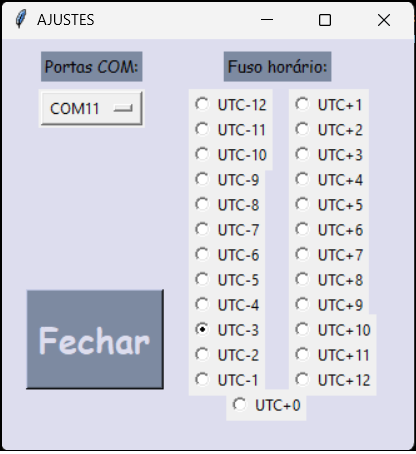

*Figura 4 – Tela de ajustes.*

> **ATENÇÃO:** Caso seja selecionada a porta de comunicação incorreta, o programa de operação do velocímetro não iniciará. Caso isso ocorra, feche o aplicativo, como mostrado na figura 05, e execute-o novamente. O aplicativo encontra-se no diretório "rasp", localizado na área de trabalho, nomeado como "Velo.V1.8.py".

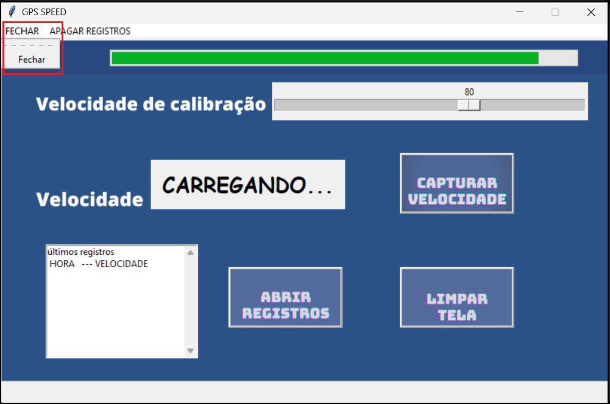

*Figura 5 – Tela do aplicativo destacando a opção para fechar o programa.*

**4° Passo:** Selecione a velocidade desejada para realizar a calibração na barra escalar, conforme mostra a figura 06. Quando a velocidade em tempo real mostrada pelo dispositivo estiver mais de 1 km/h acima ou abaixo da velocidade escolhida na barra escalar, o visor ficará vermelho; caso esteja dentro do intervalo de tolerância (± 1 km/h), o visor ficará verde, auxiliando a captura de uma velocidade mais precisa.


*Figura 6 – Tela do aplicativo destacando a opção para escolher uma velocidade de calibração, os botões, a velocidade e também o histórico de captura.*

A captura da velocidade e também a limpeza de tela podem ser realizadas pressionando os botões físicos, mostrados na figura 07, ou pelos botões mostrados na tela touchscreen da figura 06.


*Figura 7 – Imagem destacando a tela e os botões para capturar a velocidade e limpar a tela de histórico.*

Para acessar um documento de registros com todas as velocidades capturadas, aperte o botão na tela touchscreen, conforme demonstrado na figura 06. Este mesmo documento, nomeado "log.txt", pode ser acessado via sistema operacional na pasta da área de trabalho onde se encontra o programa do velocímetro, e copiado para um pendrive pelo conector USB da figura 08. O documento de registro pode ser limpo, apagando todos os dados salvos, usando a opção da barra de menus mostrada na figura 09.

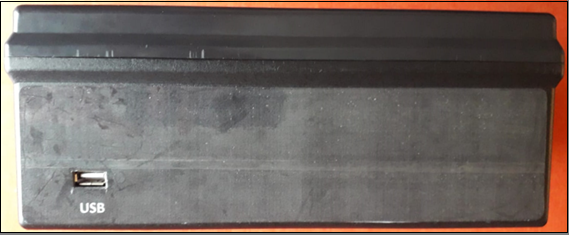

*Figura 8 – Vista lateral mostrando o conector USB.*

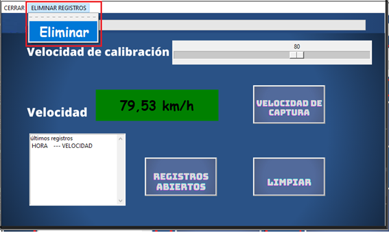

*Figura 9 – Tela do aplicativo destacando a opção para limpar os dados do documento de registros de captura.*

## 3. Especificações técnicas

Este tópico aborda informações técnicas sobre os itens que compõem o velocímetro, além de detalhar a montagem e as especificações do software.

A figura 10 mostra uma lista contendo as especificações técnicas das principais peças do velocímetro.

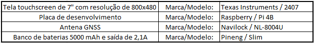

*Figura 10 – Especificações técnicas dos componentes.*

| Componente | Marca / Modelo |
|---|---|
| Tela touchscreen de 7" com resolução de 800x480 | Texas Instruments / 2407 |
| Placa de desenvolvimento | Raspberry / Pi 4B |
| Antena GNSS | Navilock / NL-8004U |
| Banco de baterias 5000 mAh e saída de 2,1 A | Pineng / Slim |

### 3.1. Hardware

A estrutura externa foi construída a partir de uma caixa plástica de ABS (acrilonitrila butadieno estireno) da marca Patola, modelo BP-225, medindo 110x175x255 mm. A figura 11 mostra a caixa usada como estrutura externa.

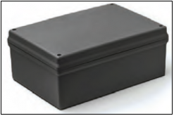

*Figura 11 – Caixa de ABS usada como estrutura externa.*

Os botões físicos usados para captura e limpeza de tela são mostrados na figura 12. Os botões são de inox de alta qualidade, trazendo mais robustez ao produto. Os botões possuem resistor de pull-down de 10 kΩ, mantendo seu estado lógico em nível baixo (0 V), e em 3,3 V quando pressionados.

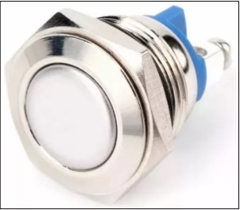

*Figura 12 – Push button usado no projeto.*

Para alimentar o projeto foi usado um power bank de 5000 mAh. Uma chave de duas posições foi inserida no cabo de alimentação da Raspberry, permitindo manter a placa de desenvolvimento desligada mesmo com o power bank ligado, pois o power bank usado tem a característica de ligar sempre que é chacoalhado.

Para realizar a conexão entre os dispositivos USB foi usado um extensor, mostrado na figura 13, a fim de evitar danos físicos nos conectores da placa de desenvolvimento. Caso ocorra algum dano, a troca do extensor será mais barata do que um reparo na porta USB da placa de desenvolvimento.

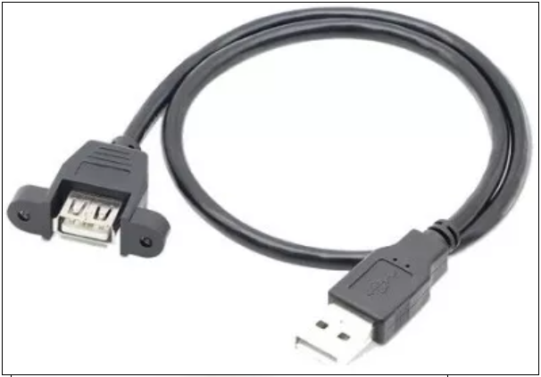

*Figura 13 – Extensão USB.*

Para realizar uma interface entre o velocímetro e o usuário, foi usada uma tela touchscreen de 7 polegadas, mostrando a velocidade capturada pela antena GNSS.

A antena GNSS recebe sinais no protocolo GNSS, que são tratados pelo software desenvolvido em Python. Qualquer antena poderá ser usada pelo velocímetro, desde que receba os protocolos `$GNVTG` e `$GNRMC`.

### 3.2. Software

O software foi desenvolvido em linguagem Python e fica lendo os dados recebidos pela antena GNSS. Quando o dado recebido é igual a `$GNVTG`, a velocidade é armazenada em uma variável e mostrada na tela. Quando o dado recebido é igual a `$GNRMC`, a data e a hora são armazenadas em duas variáveis distintas, e o valor recebido no padrão UTC é convertido para a data e hora local, a partir do fuso horário escolhido na tela de ajustes.

As duas principais bibliotecas usadas no programa são `tkinter` e `threading`. A `tkinter` é usada para gerar uma interface gráfica (GUI) na tela touchscreen; a segunda biblioteca é usada para criar e gerenciar threads em um programa Python, pois a tela gráfica gerada pela primeira biblioteca mantém o código Python preso à execução da tela até que esta seja fechada, impedindo que as próximas linhas de código sejam executadas. Dessa forma, uma thread executa a GUI e a outra thread executa as demais linhas do código Python.

Além das bibliotecas citadas anteriormente, existe mais uma biblioteca chamada `Com`, que foi criada apenas para configurar a porta serial e o fuso horário. Esta biblioteca é chamada pelo software no momento de sua execução, criando uma tela de ajustes que permite configurar qual é a porta serial usada pela antena GNSS e qual é o fuso horário local.

Dois botões foram criados para capturar a velocidade mostrada na tela e também para limpar as velocidades registradas na tela. O botão físico para capturar a velocidade, mostrado na figura 07, chama uma função de interrupção por borda de descida; dessa forma, a velocidade é capturada no mesmo instante em que o botão é pressionado. Isso ajuda a garantir que o sistema permaneça responsivo e evita que um único processo monopolize os recursos do sistema. Já o botão para limpeza de tela é acionado por polling.

Ao acionar o botão de captura de velocidade, tanto físico como virtual, a velocidade mostrada na tela é salva em um documento de texto (`log.txt`). O botão para limpeza de tela não apaga esses registros do documento, apaga apenas da tela de registro de captura da figura 06. Sempre que o programa é executado, a data e hora são salvas no documento de registro, salvando na sequência apenas as velocidades capturadas. O `log.txt` é limpo apenas quando selecionada a opção da barra de menu da figura 09.

O software é executado sobre um sistema operacional Raspbian. Para que o software seja executado automaticamente após o sistema operacional ligar, foi criado um arquivo de serviço com a extensão `.service` no diretório `/etc/systemd/system/`. O arquivo pode ser criado através do terminal com o seguinte comando:

```bash
sudo nano /etc/systemd/system/nome_do_arquivo.service
```

O arquivo de serviço deve conter as seguintes linhas:

```ini
[Unit]
Description=Meu serviço Python
After=display-manager.service

[Service]
Environment=DISPLAY=:0
Environment=XAUTHORITY=/home/myuser/.Xauthority
ExecStart=/usr/bin/python3 /path/to/my/script.py
WorkingDirectory=/path/to/my
Restart=always
User=myuser

[Install]
WantedBy=multi-user.target
```

Os seguintes valores devem ser alterados de acordo com o diretório e o nome do script em Python:

- Substitua `/path/to/my/script.py` pelo caminho completo do seu script Python.
- Substitua `/path/to/my` pelo diretório onde o script está localizado.
- Substitua `myuser` pelo nome do usuário que você deseja usar para executar o serviço.

No terminal, digite os seguintes comandos (`nome_do_arquivo` é o nome dado ao arquivo `.service`):

- `sudo systemctl daemon-reload` para recarregar as configurações do systemd.
- `sudo systemctl start nome_do_arquivo` para iniciar o serviço.
- `sudo systemctl status nome_do_arquivo` para verificar se o serviço está sendo executado corretamente.
- `sudo systemctl enable nome_do_arquivo` para habilitar o serviço, para que seja iniciado automaticamente na inicialização do Linux.

## 4. Diagrama

A figura 14 representa um diagrama das conexões entre as peças.


*Figura 14 – Diagrama representando a conexão entre as peças.*

## 5. Teste de campo

Este tópico evidencia alguns testes realizados em campo.

A figura 15 mostra um teste realizado dentro de um veículo que estava a 38 km/h. A velocidade registrada à esquerda da figura 15 foi capturada pelo protocolo `$GNRMC`, e a velocidade à direita da figura 15 foi capturada pelo protocolo `$GNVTG`, evidenciando que o protocolo `$GNRMC` não fornece uma velocidade confiável.

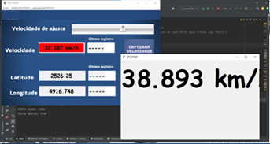

*Figura 15 – Velocidades capturadas pelo protocolo `$GNRMC` à esquerda, e `$GNVTG` à direita.*

Um teste de velocidade foi realizado fazendo passagens num ponto de teste com radar. Na figura 16 são mostradas as passagens capturadas pelo radar já calibrado, e na figura 17 são mostradas as velocidades capturadas pelo velocímetro assistido por GNSS.

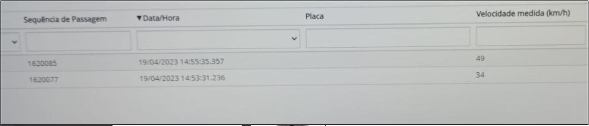

*Figura 16 – Velocidades capturadas pelo radar de teste.*

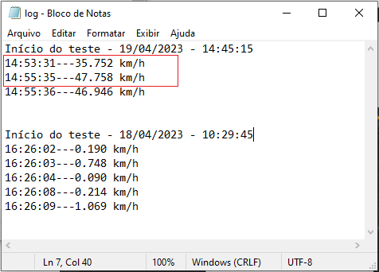

*Figura 17 – Velocidades registradas pelo velocímetro assistido por GNSS.*

## 6. Futuras melhorias

Este tópico aborda algumas futuras melhorias para o velocímetro.

A captura de velocidade realizada automaticamente a partir de uma posição escolhida pelo usuário poderia melhorar o uso do equipamento. Dessa maneira, o usuário não precisaria capturar a velocidade através do botão: a velocidade seria capturada automaticamente quando o velocímetro passasse pelas coordenadas escolhidas pelo usuário. Para isso, a antena deve capturar as coordenadas de forma muito precisa, característica não adequada para a antena usada atualmente, a Navilock NL-8004U, que tem um raio de precisão de aproximadamente 5 metros sem o SBAS (sistema de aumento baseado em satélite), e de 2 metros usando o SBAS.

Outro ponto a ser melhorado é a estrutura externa. Uma estrutura mais compacta e moderna pode ser construída usando uma impressora 3D.

Para alimentação do projeto foi usado um power bank de 5000 mAh. O power bank usado desativa suas saídas sempre que entra em modo de carga de bateria, a fim de proteger a bateria. Para poder usar o velocímetro ao mesmo tempo em que carrega a bateria, deverá ser usado um sistema de gerenciamento de carga.
